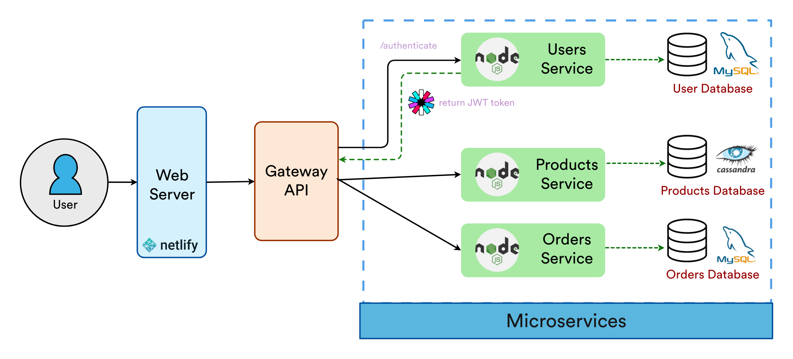

# [SquidShop](https://squidshop.netlify.app/) Ecommerce Monorepo

[](https://github.com/spencerlepine/squidshop-ecommerce/actions/workflows/node_ci.yml) [](https://github.com/spencerlepine/squidshop-ecommerce/actions/workflows/docker_ci.yml) [](https://github.com/spencerlepine/squidshop-ecommerce/actions/workflows/frontend_deploy.yml) [](https://github.com/spencerlepine/squidshop-ecommerce/actions/workflows/codeql.yml) [](https://github.com/spencerlepine/squidshop-ecommerce/actions/workflows/docker_scan.yml)

Ocean-themed ecommerce web app connected to microservice architecture backend.

## 🎯 Project Overview

- **React** and **Material UI** frontend deployed to **Netlify**, connected to backend built with **Node.js**
- Decoupled microservice architecture running **Docker** containers for the gateway, **RESTful API** services, and databases
- Authentication with JSON Web Tokens (**JWT**), storing tokens securely in HttpOnly Cookies
- Usage of **MySQL** relational and **Cassandra** NoSQL databases to optimize scaling for each use case
- Continuous Integration with **GitHub Actions**, enforcing **ESLint** code styling, testing with **Jest**, and building Docker images
- Automated scanning for static code and Docker images, tied with **Dependabot** to prevent known security vulnerabilities


     




## ⚙️ Setup
Simply clone the repository and run the containers, as long as you have [Docker](https://docs.docker.com/get-docker/) installed.

```
$ git clone https://github.com/spencerlepine/squidshop-ecommerce.git
$ cd squidshop-ecommerce
$ docker-compose up
# visit localhost:3000 in the browser
```