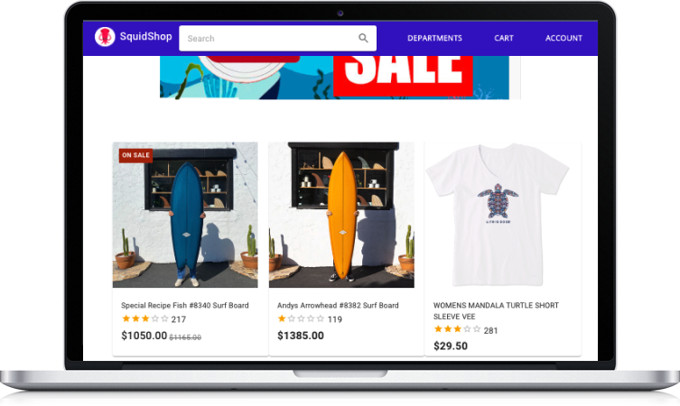

# SquidShop Ecommerce Monorepo

Ocean-themed ecommerce application built with React/MaterialUI, microservice architecture TypeScript Node.js backend, Cassandra NoSQL database, and MySQL database. Includes CI/CD pipeline using GitHub Actions to run end-to-end Cypress tests and deploy Netlify frontend. Connects to the Amazon EC2 backend (running Docker containers).

          



## 🎥 Demo Video + Project Walk-through

[](https://www.youtube.com/watch?v=VfxcdeF16uE)

## 🎯 Project Overview

- Designed modern and responsive frontend with **React**, **Material UI** and **TypeScript**
- Wrote unit, integration, and end-to-end tests with **Jest** and **Cypress**
- Developed decoupled microservice architecture backend with **RESTful API** services and gateway API, running **Docker** containers
- Secured client and server authentication with JSON Web Tokens (**JWT**), storing tokens securely in browser HttpOnly cookies
- Managed the **MySQL** relational and **Cassandra** NoSQL databases to optimize scaling for each use case
- Automated continuous integration with **GitHub Actions**, enforcing **ESLint** code styling, testing, and building Docker images
- Automated scanning for static code and Docker images, tied with **Dependabot** to prevent known security vulnerabilities

## 📦 Technologies:
- [React](https://reactjs.org/)
- [TypeScript](https://www.typescriptlang.org/)
- [Cypress](https://www.cypress.io/)
- [Jest](https://jestjs.io/)
- [Node.js](https://nodejs.org/en/) / [Express](https://expressjs.com/)
- [Docker](https://www.docker.com/)
- [GitHub Actions](https://github.com/features/actions)
- [MySQL](https://www.mysql.com/)
- [Cassandra](https://cassandra.apache.org/_/index.html)

## 🏗️ Architecture


## 🌟 Features

### Browse Product Catalog
View the catalog on the landing page. Find on-sale items, search by department, and search all products with sorting options to filter by price, name, or rating.


### Create an Account
Sign in or create an account with email/password, authenticating with JWT Tokens and HTTPOnly cookies.


### Add to Cart and Place Orders
Store items in cart (persisted on the backend) and track order history for your profile.


## ⚙️ Local Development

Clone the repository and run the containers (must have [Docker](https://docs.docker.com/get-docker/) installed)

```
$ git clone https://github.com/spencerlepine/squidshop-ecommerce.git
$ cd squidshop-ecommerce
$ docker-compose up
# visit localhost:3000 in the browser
```

## 🌐 Links

- Demo website: (DEPRACATED) [https://squidshop.netlify.app/](https://squidshop.netlify.app/)
- Demo video: [Youtube video](https://www.youtube.com/watch?v=VfxcdeF16uE)
- Blog post: [https://www.spencerlepine.com/portfolio/squidshop-ecommerce](https://www.spencerlepine.com/portfolio/squidshop-ecommerce)

