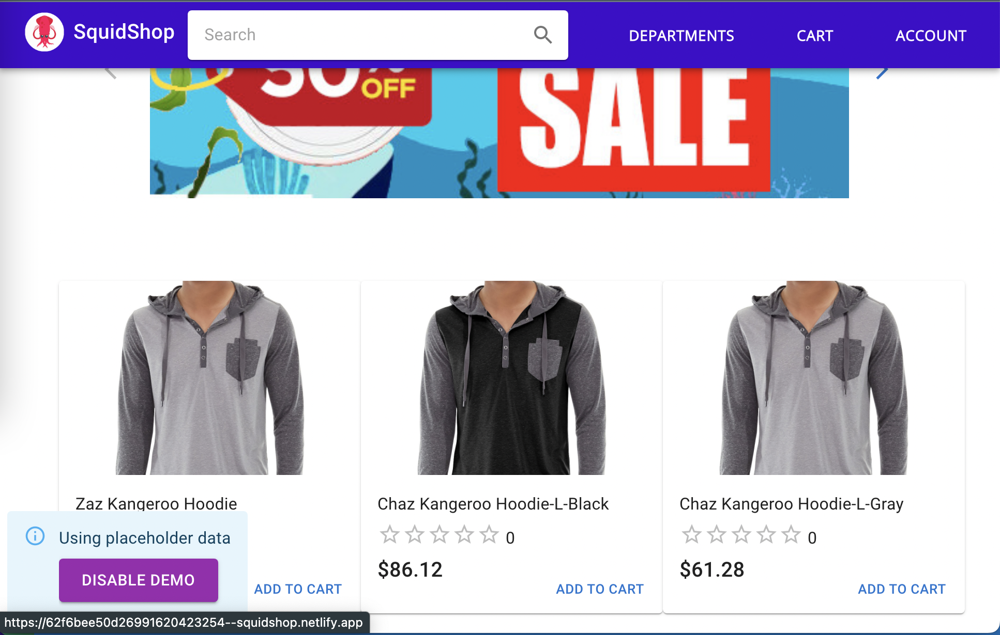
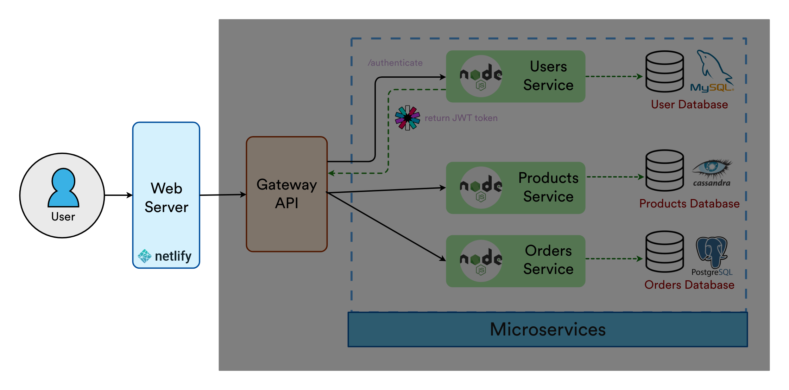

# Client - SquidShop Ecommerce 

React Frontend client for the  SquidShop Ecommerce website. Uses continuous integration to lint, test, and build with `GitHub Actions`.

    





## ⚙️ Startup and Configuration

1. ### Update Environment Variables
Either create an [`.env`](./.env.sample) file or [`docker-compose.yml`](./docker-compose.yml)

2. ### Run the Docker Container
```sh
$ docker-compose up -d
# runs on localhost:3000
```

## (Alternative) Development Setup
```sh
$ cp .env.sample .env
$ yarn install
$ yarn run start
# NOW: running on localhost
# Extra: yarn run test
# Extra: yarn run lint
# Extra: yarn run build
```

## Linter
Uses personal [@spencerlepine](https://github.com/spencerlepine/lint-config) lint configuration with `ESLint` and `Prettier`.