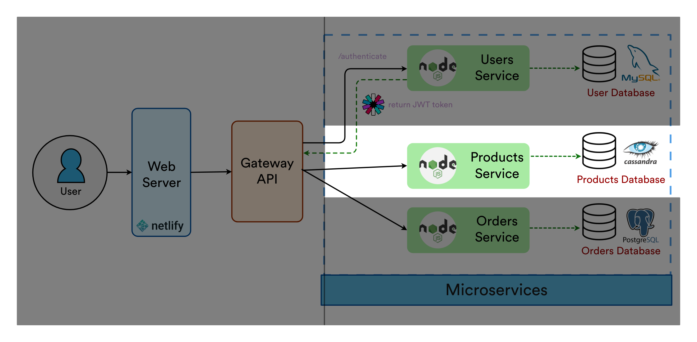

# Products API Service - SquidShop Ecommerce

Products API microservice to store and magange product records. Connected to NoSQL Cassandra database. Uses continuous integration to lint, test, and build with `GitHub Actions`.

       



## ⚙️ Startup and Configuration

1. ### Update Environment Variables
Either create an [`.env`](./.env.sample) file or [`docker-compose.yml`](./docker-compose.yml)

2. ## Setup Cassandra Database (locally)

2a. Run Cassandra and enter `cqlsh` in terminal of docker container:
```sh
docker run -d --name cassandra-docker -p 9042:9042 cassandra
docker exec -it cassandra-docker bash
cqlsh # type that, it will enter the cqlsh shell
```

2b. Paste [`db.init.cql`](./db.init.cql) script to initialize database
```sql
-- still inside of cqlsh
CREATE KEYSPACE mykeyspace WITH replication = {'class': 'NetworkTopologyStrategy', 'datacenter1': '3'}  AND durable_writes = true;

USE mykeyspace;

CREATE TABLE products (
...
```
3. ### Run the Docker Container
```sh
$ docker-compose up -d
# connects to Cassandra database
# runs node/express api on localhost
```

## (Alternative) Development Setup
```sh
$ cp .env.sample .env
$ yarn install
$ yarn run start
# NOW: running on localhost
# Extra: yarn run test
# Extra: yarn run lint
```

## Linter
Uses personal [@spencerlepine](https://github.com/spencerlepine/lint-config) lint configuration with `ESLint` and `Prettier`.