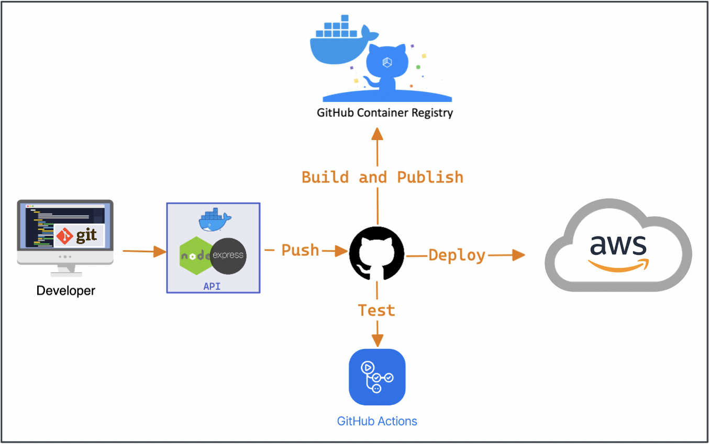

# NodeJS, Express, and Docker Boilerplate

[](https://github.com/spencerlepine/express-docker-boilerplate/actions/workflows/ci.yml) [](https://github.com/spencerlepine/express-docker-boilerplate/actions/workflows/publish-to-ghcr.yml)[](https://img.shields.io/github/v/tag/spencerlepine/express-docker-boilerplate) [](https://img.shields.io/github/v/tag/spencerlepine/express-docker-boilerplate?color=%233D9970)

NodeJS, Express, and Docker Boilerplate. CI/CD using GitHub Actions. Published to GitHub Container Registry.
## Setup
```sh
$ git clone https://github.com/spencerlepine/express-docker-boilerplate.git
$ cd express-docker-boilerplate
$ docker-compose up -d
# access on localhost:3000
```



## Test
```sh
$ docker-compose exec api yarn run test
```

## Pull from GitHub Repository Container Registry
```sh
# docker pull ghcr.io/OWNER/IMAGE_NAME
$ docker pull ghcr.io/spencerlepine/express-docker-boilerplate:0.1.0
```